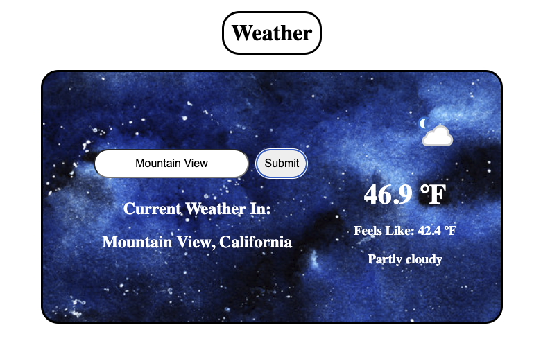

# React Weather App

This project is a city search engine by name or zipcode that provides current weather information.

## What I Learned:

- fetching api data
- changing states with useState
- using ternary operators to implement different class names

Live Demo:
https://bmoran17.github.io/react-weather-app/

Preview:
